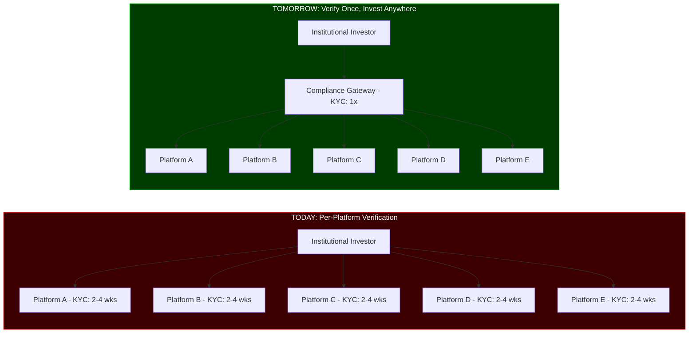
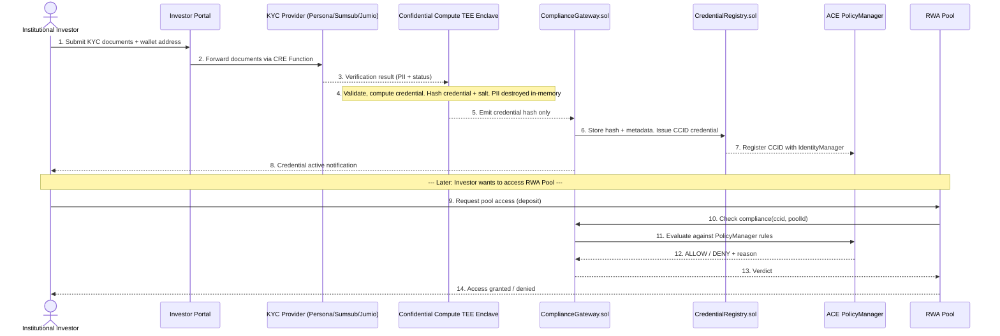
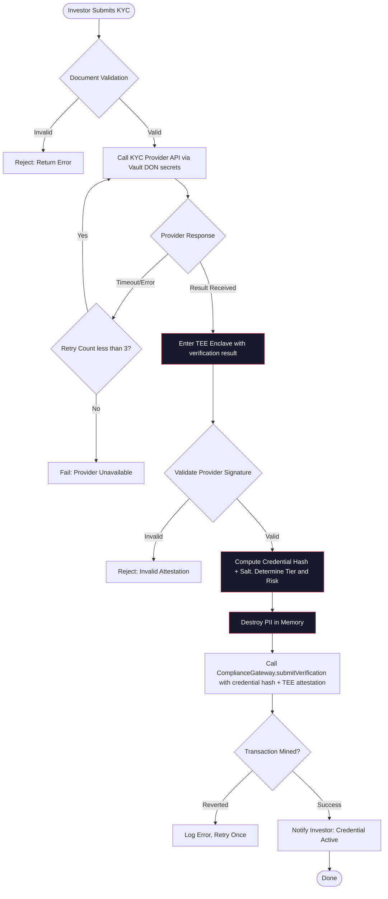

# Product Requirements Document -- RWA Compliance Gateway

**Document Version:** 1.0
**Status:** Draft -- Active Development
**Target Release:** Q3 2026
**Solo Engineering Timeline:** 7-9 weeks
**Target Scale:** 50,000+ institutional investors, 200+ RWA platforms

---

## Table of Contents

1. [Executive Summary](#1-executive-summary)
2. [Problem Statement](#2-problem-statement)
3. [Solution Overview](#3-solution-overview)
4. [User Personas](#4-user-personas)
5. [Functional Requirements](#5-functional-requirements)
6. [Non-Functional Requirements](#6-non-functional-requirements)
7. [Smart Contract Architecture](#7-smart-contract-architecture)
8. [CRE Workflow Architecture](#8-cre-workflow-architecture)
9. [ACE Integration Architecture](#9-ace-integration-architecture)
10. [Data Privacy and GDPR Compliance](#10-data-privacy-and-gdpr-compliance)
11. [Risk Register](#11-risk-register)
12. [System Invariants](#12-system-invariants)
13. [Glossary](#13-glossary)

---

## 1. Executive Summary

### Market Context

The tokenized Real-World Asset (RWA) market has reached **$26-32 billion** in total value locked, growing at approximately **589% year-over-year**. This explosive growth is driven by institutional demand for on-chain access to traditional asset classes -- real estate, private credit, treasury yields, commodities, and trade finance.

A watershed moment is approaching: **DTCC (Depository Trust and Clearing Corporation)** is building collateral rails on **Chainlink CRE**, targeting a **Q4 2026 launch**. This will bring the world's largest securities settlement infrastructure -- processing over $2.5 quadrillion annually -- onto Chainlink-enabled infrastructure. The RWA tokenization ecosystem must be ready with institutional-grade compliance tooling before this catalyst hits.

In **May 2026**, Chainlink announced a strategic partnership with **Persona**, a leading identity verification platform. This partnership validates the "compliance as a primitive" thesis and provides the production-grade KYC/AML infrastructure needed for institutional adoption.

### The Opportunity

Every institutional investor entering the RWA ecosystem today faces the same bottleneck: **per-platform KYC/AML onboarding**. A fund deploying capital across five RWA platforms must complete five separate identity verifications, five separate accreditation checks, and five separate jurisdiction reviews. Each takes **2-4 weeks**, creating a cumulative friction of **10-20 weeks** before capital is fully deployed.

The RWA Compliance Gateway eliminates this friction entirely. Investors verify **once**, receive a **CCID-linked compliance credential**, and gain access to **all** participating RWA pools across **all** supported chains. This is the "passport for institutional DeFi" -- built on Chainlink's production infrastructure and designed for the DTCC era.

### Strategic Alignment

| Chainlink Component | Role in RWA Compliance Gateway |
|--------------------|-------------------------------|
| **ACE (Automated Compliance Engine)** | Core identity and policy infrastructure: CCID, PolicyManager, IdentityManager |
| **CRE (Chainlink Runtime Environment)** | Workflow orchestration: KYC verification, credential issuance, renewal, revocation |
| **Confidential Compute** | TEE-based PII processing: identity data never touches blockchain |
| **CCIP v2** | Cross-chain credential propagation: verify on Ethereum, invest on Arbitrum/Base |
| **Automation** | Credential lifecycle triggers: expiry monitoring, renewal scheduling |
| **Proof of Reserve** | Real-time RWA pool attestation: on-chain tokens = off-chain reserves |

---

## 2. Problem Statement

### Current State: Per-Platform KYC Friction



### Pain Points

1. **Redundant Verification:** The same institutional entity submits the same documents (certificate of incorporation, tax ID, ownership structure, beneficial owner KYC) to every RWA platform independently.

2. **2-4 Week Onboarding Per Platform:** Each platform's compliance team manually reviews documents, conducts background checks, and verifies accreditation status. This serial process means capital sits idle.

3. **Jurisdictional Complexity:** A Cayman-domiciled fund with EU investors deploying into a U.S. real-estate pool must satisfy three overlapping regulatory regimes. No platform provides unified jurisdictional compliance.

4. **No Portable Identity:** Verification results are siloed within each platform. There is no mechanism for an investor to prove "I am already verified" to the next platform.

5. **Privacy Concerns:** Current solutions require investors to trust each platform with sensitive identity documents. Data breach risk multiplies with each additional platform.

6. **Regulatory Uncertainty for Issuers:** RWA issuers must independently verify investor compliance, creating legal exposure if verification is inadequate. A standardized, auditable compliance framework reduces this risk.

### Quantified Impact

| Metric | Current State | With Compliance Gateway |
|--------|--------------|------------------------|
| Onboarding time (5 platforms) | 10-20 weeks | 1-2 weeks |
| KYC submissions per investor | 5+ | 1 |
| Identity documents exposed to platforms | 5+ copies | 0 (hash only) |
| Issuer compliance setup time | 2-4 weeks per pool | 1-2 days (policy config) |
| Cross-chain re-verification | Required | Not required (CCIP) |

---

## 3. Solution Overview

### Verify-Once-Invest-Anywhere Architecture

The RWA Compliance Gateway is a **compliance automation layer** that sits between institutional investors and RWA pools. It leverages Chainlink's decentralized infrastructure to process identity verification in a privacy-preserving manner and issue portable, cross-chain compliance credentials.



### Core Design Principles

1. **Privacy by Architecture:** PII never enters the blockchain. Chainlink Confidential Compute (TEE) processes identity data and outputs only a cryptographic hash. This is not a policy choice -- it is enforced by the architecture.

2. **ACE-Native Identity:** The system builds on Chainlink ACE primitives (`CCID`, `PolicyManager`, `IdentityManager`) rather than reinventing identity infrastructure. This ensures compatibility with the broader Chainlink ecosystem and future ACE features.

3. **Decentralized Compliance Verification:** No single party controls compliance decisions. The CRE DON executes verification workflows; the ACE PolicyManager evaluates rules; the on-chain registry provides an immutable audit trail.

4. **Portable Credentials:** Credentials are not tied to a specific wallet or chain. The CCID is a cross-chain identity primitive; CCIP v2 propagates credential state across supported networks.

5. **Configurable, Not Hard-Coded:** Every compliance rule is configurable per pool via the PolicyManager. Jurisdiction lists, accreditation tiers, and freshness windows are all adjustable by pool issuers.

---

## 4. User Personas

### Persona 1: Institutional Investor (Primary)

**Profile:** Fund manager at a crypto-native hedge fund, family office, or traditional asset manager allocating to RWA pools. Manages $50M-$500M AUM. Has a compliance team that handles KYC/AML requirements but wants to minimize operational overhead.

**Goals:**
- Complete KYC/AML verification once and access multiple RWA pools
- Minimize document exposure to third-party platforms
- Demonstrate compliance to regulators on demand
- Deploy capital within days, not weeks

**Pain Points:**
- "I've already been KYC'd by four platforms. Why do I need to do it again?"
- "Every platform stores my fund documents. That's a data breach waiting to happen."
- "We're moving capital between chains. Do we need to re-verify on Arbitrum?"

**Interaction Flow:**
1. Submits KYC documents through investor portal (entity docs, beneficial owner KYC, accreditation evidence)
2. Selects KYC provider (Persona, Sumsub, or Jumio)
3. Receives CCID credential within minutes (automated) to 48 hours (manual review)
4. Browses available RWA pools filtered by their credential tier
5. Deposits into any compatible pool without additional verification

---

### Persona 2: RWA Issuer / Pool Operator

**Profile:** Platform operator tokenizing real-world assets (real estate, private credit, invoices, treasuries). Manages 1-10 RWA pools. Has a legal team that defines compliance requirements but needs technical enforcement.

**Goals:**
- Define and enforce compliance rules for their pools
- Accept investors without running their own KYC process
- Demonstrate regulatory compliance through auditable on-chain records
- Attract institutional capital by being part of the Compliance Gateway ecosystem

**Pain Points:**
- "We spend $50K/year on compliance review for each pool."
- "We don't know if an investor's KYC from another platform meets our standards."
- "Regulators ask for our investor verification records. It's all in PDFs and emails."

**Interaction Flow:**
1. Registers pool with Compliance Gateway via issuer dashboard
2. Configures PolicyManager rules: jurisdiction allowlist, accreditation tier minimum, max allocation
3. Publishes pool with compliance badge ("Gateway-Verified")
4. Receives pre-verified investors without running KYC
5. Monitors credential status; receives alerts on revocations affecting their pool

---

### Persona 3: Compliance Officer

**Profile:** In-house or outsourced compliance officer responsible for ensuring an RWA platform satisfies KYC/AML obligations under BSA, MiCA, and local regulations. May work for the issuer, the gateway operator, or a regulatory consultancy.

**Goals:**
- Audit investor verification records
- Review credential issuance and revocation logs
- Ensure jurisdictional rules are correctly enforced
- Respond to regulatory inquiries with complete audit trails

**Pain Points:**
- "I need to prove we checked every investor. Currently it's spread across email, Slack, and Google Drive."
- "When a credential is revoked, I need to know within hours, not days."
- "GDPR says we must delete data on request. How do we reconcile that with blockchain immutability?"

**Interaction Flow:**
1. Accesses compliance dashboard with role `COMPLIANCE_OFFICER`
2. Views audit trail: timestamped credential events (issue, renew, revoke) with TEE attestations
3. Exports compliance reports for regulatory filings
4. Initiates manual credential revocation when required (e.g., sanctions list update)

---

### Persona 4: Regulator

**Profile:** Government regulator (SEC, ESMA, MAS, FCA) overseeing securities laws, AML compliance, and investor protection in tokenized asset markets.

**Goals:**
- Verify that RWA platforms enforce required investor checks
- Access audit trails without requiring cooperation from individual platforms
- Ensure cross-border compliance with jurisdictional rules

**Pain Points:**
- "Tokenized assets are opaque. We can't see who's investing or whether KYC was done."
- "Platforms claim they're compliant. We have no independent way to verify."

**Interaction Flow:**
1. Receives read-only access to on-chain credential registry (public events, no PII)
2. Verifies that credential issuance events correlate with TEE attestations
3. Confirms that jurisdictional rules are encoded in PolicyManager and enforced at transaction time
4. Audits without relying on platform self-reporting

---

## 5. Functional Requirements

### 5.1 Investor Onboarding and Identity Verification

| ID | Requirement | Priority | Dependencies |
|----|------------|----------|--------------|
| **FR-001** | The system MUST provide an investor portal where institutional investors can initiate KYC/AML verification by submitting entity documentation (certificate of incorporation, tax ID, ownership structure, beneficial owner PII). | P0 | CRE Functions, KYC provider APIs |
| **FR-002** | The system MUST support integration with at least three licensed KYC/AML providers: Persona, Sumsub, and Jumio, with a provider selection interface for investors. | P0 | Provider API contracts, Vault DON for API keys |
| **FR-003** | The system MUST route all PII (names, document images, ID numbers, addresses) exclusively through the Chainlink Confidential Compute TEE enclave. At no point may PII appear in Solidity storage, event logs, calldata, or CRE DON memory outside the TEE. | P0 | Chainlink Confidential Compute |
| **FR-004** | The KYC provider verification result MUST be validated within the TEE enclave using the provider's cryptographic signature before a credential is issued. | P0 | Provider public keys in CRE secrets |
| **FR-005** | The system MUST support entity-level KYC (corporations, trusts, funds) including beneficial ownership verification per FATF Recommendation 24. | P0 | KYC provider entity verification APIs |
| **FR-006** | The system MUST verify investor accreditation status (e.g., qualified purchaser under US Investment Company Act Section 3(c)(7), professional investor under MiFID II) via document review and/or third-party attestation services. | P0 | Accreditation verification service integration |
| **FR-007** | The system MUST perform jurisdiction checks against the investor's country of domicile, country of incorporation, and beneficial owner nationalities. The system MUST maintain a jurisdiction risk classification database (low/medium/high/unavailable). | P0 | `JurisdictionLib.sol` |
| **FR-008** | The system MUST return a structured verification result from the TEE containing: credential hash, accreditation tier (1-4), jurisdiction risk classification, verification timestamp, credential expiry timestamp, and provider attestation signature. | P0 | TEE output format specification |

### 5.2 Credential Issuance and Management

| ID | Requirement | Priority | Dependencies |
|----|------------|----------|--------------|
| **FR-009** | The system MUST issue a CCID-linked compliance credential on-chain via `CredentialRegistry.sol` upon successful TEE verification. The credential MUST include: `credentialHash` (bytes32), `ccid` (uint256), `issuanceTimestamp` (uint64), `expiryTimestamp` (uint64), `accreditationTier` (uint8), `jurisdictionRisk` (uint8), and `providerId` (uint8). | P0 | ACE CCID, `CredentialRegistry.sol` |
| **FR-010** | The system MUST support credential renewal triggered by Chainlink Automation before expiry. The automation `Upkeep` contract MUST call the renewal CRE workflow 30 days before expiry and retry daily until renewal or expiry. | P0 | Chainlink Automation, CRE renewal workflow |
| **FR-011** | The system MUST support credential revocation with two trigger paths: (a) investor-initiated voluntary revocation, and (b) compliance officer-initiated administrative revocation (e.g., sanctions list update, regulatory order). | P0 | `CredentialRegistry.sol` `revokeCredential()` |
| **FR-012** | The system MUST allow credential status querying by any RWA pool or external contract via `isCredentialValid(bytes32 credentialHash) -> (bool valid, uint8 tier, uint8 jurisdictionRisk, uint64 expiry)` -- a gas-optimized view function. | P0 | `CredentialRegistry.sol` |
| **FR-013** | The system MUST maintain a mapping from CCID to active credential hash, allowing credential lookup by CCID: `getActiveCredential(uint256 ccid) -> (bytes32 credentialHash, bool exists)`. A CCID can have exactly one active credential at any time. | P0 | `CredentialRegistry.sol` |
| **FR-014** | The system MUST emit events for all credential lifecycle state transitions: `CredentialIssued`, `CredentialRenewed`, `CredentialRevoked`, `CredentialExpired`. Events MUST include the credential hash, CCID, timestamp, and actor address. | P0 | `CredentialRegistry.sol` |
| **FR-015** | The system MUST support credential expiry with a configurable validity period (default: 365 days for KYC, 90 days for accreditation-only refresh). Expired credentials MUST be treated as invalid by `PoolComplianceModule.sol`. | P1 | Chainlink Automation |

### 5.3 Pool Compliance Configuration

| ID | Requirement | Priority | Dependencies |
|----|------------|----------|--------------|
| **FR-016** | The system MUST allow RWA issuers to configure per-pool compliance rules via the ACE `PolicyManager`. Rules are stored as a `PoolPolicy` struct. | P0 | ACE PolicyManager |
| **FR-017** | Each `PoolPolicy` MUST support the following rule dimensions: `minAccreditationTier` (uint8, 1-4), `allowedJurisdictions` (uint256 bitmap), `blockedJurisdictions` (uint256 bitmap), `maxCredentialAge` (uint64 seconds), `maxAllocationPerInvestor` (uint256), `requiresActiveCredential` (bool). | P0 | `PoolComplianceModule.sol` |
| **FR-018** | The system MUST support dynamic policy updates by the pool issuer (via multi-sig + timelock) without requiring pool contract redeployment. | P0 | UUPS proxy, `AccessControl` |
| **FR-019** | The system MUST provide a `checkCompliance(bytes32 credentialHash, uint256 poolId)` function that evaluates the credential against the pool's policy and returns `(bool allowed, bytes32 reason)`. | P0 | `PoolComplianceModule.sol` |
| **FR-020** | The system MUST support jurisdiction bitmap encoding for up to 256 jurisdiction codes, using a standardized jurisdiction code registry (ISO 3166-1 alpha-2 mapped to uint8 indices). | P1 | `JurisdictionLib.sol` |
| **FR-021** | The system MUST support pool-level emergency pause that prevents new investor access while preserving existing investor positions. MUST be triggered by `COMPLIANCE_OFFICER` role and emit `PoolCompliancePaused(poolId)`. | P1 | `PoolComplianceModule.sol` |

### 5.4 Cross-Chain Credential Propagation

| ID | Requirement | Priority | Dependencies |
|----|------------|----------|--------------|
| **FR-022** | The system MUST propagate credential state across supported chains via Chainlink CCIP v2. When a credential is issued, renewed, or revoked on the source chain, the state change MUST be transmitted to all registered destination chains within CCIP finality latency (~10-20 minutes). | P0 | CCIP v2 |
| **FR-023** | The system MUST deploy a `CrossChainCredentialReceiver` contract on each supported destination chain that accepts CCIP messages and updates a local credential registry. | P0 | CCIP v2, `CrossChainCredentialReceiver.sol` |
| **FR-024** | Cross-chain credential messages MUST include the credential hash, CCID, action type (ISSUE/RENEW/REVOKE), and source chain identifier. Messages MUST be validated against the source chain's CCIP sender address. | P0 | CCIP v2 message validation |
| **FR-025** | The system MUST support chain registration: `registerDestinationChain(uint64 chainSelector, address receiver)` and `unregisterDestinationChain(uint64 chainSelector)` callable by `ADMIN` role only. | P1 | CCIP v2 |

### 5.5 Automation and Monitoring

| ID | Requirement | Priority | Dependencies |
|----|------------|----------|--------------|
| **FR-026** | Chainlink Automation MUST monitor credential expiry and trigger renewal workflows. The `checkUpkeep` function returns true when `block.timestamp > expiryTimestamp - RENEWAL_WINDOW` (30 days). The `performUpkeep` function calls the CRE renewal workflow. | P0 | Chainlink Automation |
| **FR-027** | The system MUST provide a compliance dashboard (web application) for issuers and compliance officers with: pool policy editor, credential status monitor, audit log viewer, and revocation controls. | P0 | Indexed blockchain events, web frontend |
| **FR-028** | The system MUST expose all credential and pool events via a subgraph or equivalent event indexer for real-time dashboard updates and alerting. | P1 | The Graph / custom indexer |
| **FR-029** | The system MUST send real-time alerts (email, webhook) on credential revocation events to all pools where the affected CCID has active deposits. | P2 | Event listener, notification service |

### 5.6 Proof of Reserve Integration

| ID | Requirement | Priority | Dependencies |
|----|------------|----------|--------------|
| **FR-030** | The system MUST integrate Chainlink Proof of Reserve to provide on-chain attestation of RWA pool collateralization. Each pool SHOULD register its PoR feed with the Gateway. | P1 | Chainlink PoR |
| **FR-031** | The `PoolComplianceModule.sol` MUST provide a `checkReserveRatio(uint256 poolId) -> (bool sufficient, uint256 ratio)` function that queries the pool's PoR feed and returns whether reserves meet the minimum threshold (configurable, default 100%). | P1 | Chainlink PoR feed |
| **FR-032** | The compliance dashboard MUST display real-time reserve ratios for monitored pools, with alerts when a pool falls below its configured threshold. | P2 | PoR feeds, dashboard |

### 5.7 Fee and Economics

| ID | Requirement | Priority | Dependencies |
|----|------------|----------|--------------|
| **FR-033** | The system MUST support an optional verification fee, configurable by the gateway operator in basis points (1 bp = 0.01%). Fee calculation MUST use `ComplianceMath.sol` to prevent rounding errors. | P2 | `ComplianceMath.sol` |
| **FR-034** | The system MUST handle fee-on-transfer tokens correctly when verification fees are collected. The `_collectFee` internal function MUST compare actual token received against expected amount and revert if the difference exceeds `MAX_FEE_ON_TRANSFER_SLIPPAGE` (default: 1%). | P2 | `ComplianceMath.sol`, SafeERC20 |
| **FR-035** | The system MUST track total verification count and fee revenue per pool via on-chain counters, queryable via `getPoolStats(uint256 poolId) -> (uint256 verifications, uint256 feesCollected)`. | P2 | `PoolComplianceModule.sol` |

---

## 6. Non-Functional Requirements

### 6.1 Data Privacy and GDPR

| ID | Requirement | Priority |
|----|------------|----------|
| **NFR-001** | The system MUST NOT store any PII on-chain, in event logs, or in calldata. Only credential hashes and metadata (tier, jurisdiction risk classification, timestamps) may exist on-chain. | P0 |
| **NFR-002** | The system MUST support GDPR Right to Erasure (Article 17) via credential revocation. Revocation zeroes the on-chain credential hash mapping. Off-chain PII at KYC providers is deleted per the provider's Data Processing Agreement (DPA) with the gateway operator. | P0 |
| **NFR-003** | The system MUST implement data minimization (GDPR Article 5(1)(c)) by design: the TEE processes PII in-memory and only outputs the credential hash. No PII is persisted by the gateway infrastructure at any layer. | P0 |
| **NFR-004** | The gateway operator MUST maintain DPAs with all integrated KYC providers. Template DPAs MUST be included in the project repository under `legal/dpa-templates/`. | P1 |
| **NFR-005** | Investors MUST provide explicit consent for data processing before KYC submission, with clear disclosure of: which providers will process data, what data is collected, purpose limitation (compliance verification only), and retention period. | P1 |

### 6.2 Audit Trail and Transparency

| ID | Requirement | Priority |
|----|------------|----------|
| **NFR-006** | All credential lifecycle events (issue, renew, revoke, expire) MUST be emitted as on-chain events on the source chain, indexed by CCID and credential hash. | P0 |
| **NFR-007** | Pool policy changes MUST be emitted as events with old and new policy contents, actor address, and timestamp. | P0 |
| **NFR-008** | The system MUST record the TEE attestation report hash on-chain with each credential issuance, enabling independent verification that the credential was produced by a genuine TEE enclave running the correct code. | P0 |
| **NFR-009** | A verifiable audit report generator MUST be available for compliance officers that correlates on-chain events with TEE attestations and CCIP cross-chain messages. | P1 |

### 6.3 Performance and Availability

| ID | Requirement | Priority |
|----|------------|----------|
| **NFR-010** | Credential issuance MUST complete within 10 minutes for automated verifications (Provider -> TEE -> On-chain). Manual review cases MAY take up to 48 hours. | P1 |
| **NFR-011** | The `checkCompliance()` function MUST execute within 200,000 gas on Ethereum L1 for a single credential-pool pair. | P1 |
| **NFR-012** | The system MUST maintain 99.9% availability for credential queries, relying on blockchain node redundancy rather than centralized infrastructure. | P1 |
| **NFR-013** | Cross-chain credential propagation via CCIP MUST complete within 30 minutes under normal network conditions. | P1 |

### 6.4 Security

| ID | Requirement | Priority |
|----|------------|----------|
| **NFR-014** | All smart contracts MUST achieve >=90% test coverage including branch coverage. Unit tests, fuzzing (Foundry `forge test --fuzz-runs 10000`), and invariant tests MUST be included. | P0 |
| **NFR-015** | Slither and Aderyn MUST run in CI on every PR and produce zero warnings. Suppressed warnings require explicit justification in `slither.db.json` or `.aderyn.json`. | P0 |
| **NFR-016** | All contracts MUST use `ReentrancyGuardTransient` (OpenZeppelin 5.x) and follow the CEI pattern. | P0 |
| **NFR-017** | All admin functions MUST be protected by `AccessControl` with granular roles (`DEFAULT_ADMIN_ROLE`, `ISSUER_ROLE`, `COMPLIANCE_OFFICER_ROLE`, `PAUSER_ROLE`). The `Ownable` pattern is disallowed. | P0 |
| **NFR-018** | Contract upgrades MUST go through the `TimelockController` with minimum 48-hour delay. The multi-sig Safe address MUST be the proposer; the TimelockController MUST be the executor. | P0 |
| **NFR-019** | All external call return values MUST be checked. Low-level `call` MUST NOT be used without explicit success checks and gas limits. | P0 |

### 6.5 Upgradeability and Maintainability

| ID | Requirement | Priority |
|----|------------|----------|
| **NFR-020** | All contracts MUST follow the UUPS upgradeable pattern (not transparent proxy) with storage gap reserved in every contract. | P0 |
| **NFR-021** | Storage layout MUST be documented in each contract's NatSpec header with explicit slot assignments to prevent upgrade collisions. | P1 |
| **NFR-022** | All public and external functions MUST have complete NatSpec documentation including `@param`, `@return`, `@dev`, and `@notice` tags. | P0 |

---

## 7. Smart Contract Architecture

### 7.1 Inheritance and Storage Layout

#### `ComplianceGateway.sol`

```
Inheritance:
  UUPSUpgradeable
  ├── AccessControlUpgradeable
  ├── ReentrancyGuardTransientUpgradeable
  └── PausableUpgradeable

Storage:
  slot 0: __gap[50] (OpenZeppelin reserved)
  slot 50: bytes32 public tEEAttestationRegistry // Verified TEE MRENCLAVE values
  slot 51: mapping(bytes32 => bool) public usedCredentialHashes // Prevent replay
  slot 52: uint256 public credentialCounter // Monotonically increasing
  slot 53: mapping(uint256 => bool) public registeredPools
```

**Key Functions:**

| Function | Access | Description |
|----------|--------|-------------|
| `submitVerification(bytes32 credentialHash, bytes calldata tEEAttestation, uint8 providerId, uint8 accreditationTier, uint8 jurisdictionRisk, uint64 expiryTimestamp, uint256 ccid)` | `ISSUER_ROLE` | Called by CRE DON after successful TEE verification. Validates attestation, stores credential hash, emits `CredentialIssued`. |
| `registerPool(uint256 poolId)` | `ADMIN` (via Timelock) | Registers an RWA pool with the Gateway. |
| `checkCompliance(bytes32 credentialHash, uint256 poolId)` | External view | Delegates to `PoolComplianceModule` to evaluate pool policy against credential. |
| `pause()` / `unpause()` | `PAUSER_ROLE` | Emergency circuit breaker. |

#### `CredentialRegistry.sol`

```
Inheritance:
  UUPSUpgradeable
  ├── AccessControlUpgradeable
  └── ReentrancyGuardTransientUpgradeable

Storage:
  slot 0: __gap[50]
  slot 50: mapping(bytes32 => Credential) public credentials
  slot 51: mapping(uint256 => bytes32) public activeCredentialByCCID
  slot 52: mapping(uint256 => bytes32[]) public credentialHistory // All creds for a CCID

Struct Credential:
  bytes32 credentialHash;
  uint256 ccid;
  uint8 accreditationTier;       // 1-4
  uint8 jurisdictionRisk;        // 0=low, 1=medium, 2=high, 3=unavailable
  uint8 providerId;              // 1=Persona, 2=Sumsub, 3=Jumio
  uint64 issuanceTimestamp;
  uint64 expiryTimestamp;
  CredentialStatus status;       // Active, Revoked, Expired
```

**Key Functions:**

| Function | Access | Description |
|----------|--------|-------------|
| `issueCredential(Credential calldata cred)` | `ISSUER_ROLE` | Stores credential, updates CCID mapping, appends to history. Reverts if CCID already has active credential. |
| `renewCredential(bytes32 credentialHash, uint64 newExpiry)` | `ISSUER_ROLE` | Updates expiry, emits `CredentialRenewed`. |
| `revokeCredential(bytes32 credentialHash)` | `COMPLIANCE_OFFICER_ROLE` or credential holder | Sets status to Revoked, clears active mapping. |
| `isCredentialValid(bytes32 credentialHash) -> (bool, uint8, uint8, uint64)` | Public view | Returns validity + metadata. |
| `getActiveCredential(uint256 ccid) -> (bytes32, bool)` | Public view | CCID -> active credential lookup. |

#### `PoolComplianceModule.sol`

```
Inheritance:
  UUPSUpgradeable
  ├── AccessControlUpgradeable
  ├── ReentrancyGuardTransientUpgradeable
  └── PausableUpgradeable

Storage:
  slot 0: __gap[50]
  slot 50: mapping(uint256 => PoolPolicy) public poolPolicies
  slot 51: mapping(uint256 => bool) public poolPaused
  slot 52: mapping(uint256 => PoolStats) public poolStats
  slot 53: ICredentialRegistry public credentialRegistry

Struct PoolPolicy:
  uint8 minAccreditationTier;
  uint256 allowedJurisdictions;   // Bitmap, up to 256 jurisdictions
  uint256 blockedJurisdictions;
  uint64 maxCredentialAge;
  uint256 maxAllocationPerInvestor;
  bool requiresActiveCredential;

Struct PoolStats:
  uint256 totalVerifications;
  uint256 feesCollected;
```

**Key Functions:**

| Function | Access | Description |
|----------|--------|-------------|
| `setPoolPolicy(uint256 poolId, PoolPolicy calldata policy)` | `ADMIN` (via Timelock) | Configures or updates pool compliance rules. |
| `checkCompliance(bytes32 credentialHash, uint256 poolId) -> (bool allowed, bytes32 reason)` | Public view | Evaluates all policy dimensions. Returns false with a reason code if any check fails. |
| `checkReserveRatio(uint256 poolId) -> (bool sufficient, uint256 ratio)` | Public view | Queries Chainlink PoR feed for pool. |
| `getPoolStats(uint256 poolId) -> (uint256, uint256)` | Public view | Returns verification and fee counters. |

### 7.2 Compliance Check Logic

The `checkCompliance()` function in `PoolComplianceModule.sol` evaluates the following chain of checks:

```
1. Pool exists and is not paused          -> POOL_INACTIVE / POOL_PAUSED
2. Credential exists and is Active        -> CREDENTIAL_NOT_FOUND / CREDENTIAL_REVOKED
3. Credential has not expired             -> CREDENTIAL_EXPIRED
4. Credential age <= maxCredentialAge     -> CREDENTIAL_TOO_OLD
5. accreditationTier >= minAccreditationTier -> INSUFFICIENT_TIER
6. jurisdictionRisk not blocked           -> JURISDICTION_BLOCKED
7. jurisdictionRisk allowed (if allowlist configured) -> JURISDICTION_NOT_ALLOWED
8. All checks pass                        -> ALLOWED
```

Each failure returns a distinct `bytes32` reason code for precise error handling by RWA pools.

---

## 8. CRE Workflow Architecture

Chainlink CRE (Chainlink Runtime Environment) orchestrates the off-chain compliance workflows. Workflows are written in **TypeScript**, compiled to **WASM**, and executed by the **CRE DON** (Decentralized Oracle Network).

### 8.1 Onboarding Workflow



**Workflow steps detail:**

1. **Document Validation:** Validates file format, size, and completeness client-side before submission to KYC provider.
2. **KYC Provider Call:** Uses API keys stored in the Chainlink Vault DON (encrypted, never exposed to CRE code). Calls the selected provider's verification API.
3. **TEE Processing:** The verification result enters the Confidential Compute enclave. The enclave:
   - Validates the provider's Ed25519/ECDSA signature on the verification result
   - Maps the verification outcome to accreditation tier (1-4)
   - Classifies jurisdiction risk from the investor's domicile data
   - Computes `credentialHash = keccak256(abi.encode(verificationData, randomSalt, blockNumber))`
   - Destroys all PII from memory
   - Attests the computation with a TEE attestation quote
4. **On-Chain Submission:** The enclave output (hash + attestation) is submitted to `ComplianceGateway.submitVerification()`.
5. **Investor Notification:** On transaction confirmation, the portal notifies the investor that their credential is active.

### 8.2 Renewal Workflow

Triggered by Chainlink Automation `performUpkeep()`:

1. Automation detects credential within 30 days of expiry
2. CRE renewal workflow initiates a **lightweight** re-verification (accreditation status, sanctions check -- no full document re-submission)
3. If re-verification passes: TEE issues a new credential hash with updated expiry
4. `CredentialRegistry.renewCredential()` is called with the new hash and expiry
5. If re-verification fails: credential is NOT renewed; investor and compliance officer are notified

### 8.3 Revocation Workflow

1. Compliance officer (or automated sanctions-list monitor) initiates revocation
2. CRE revocation workflow verifies authorization (checks `COMPLIANCE_OFFICER_ROLE`)
3. `CredentialRegistry.revokeCredential()` is called
4. All pools with active deposits from the CCID receive an alert
5. CCIP v2 propagates the revocation to all registered destination chains
6. The credential hash is zeroed in the active mapping; the credential history retains the revocation event

---

## 9. ACE Integration Architecture

### 9.1 PolicyManager Rules

The Chainlink ACE `PolicyManager` is the rules engine that evaluates credentials against pool policies. Integration points:

- **Policy Registration:** When a pool issuer configures compliance rules via the dashboard, the `PoolComplianceModule` writes the `PoolPolicy` struct on-chain and registers the policy ID with ACE `PolicyManager`.
- **Policy Evaluation:** When `checkCompliance()` is called, it delegates to ACE `PolicyManager.evaluate(ccid, policyId)` which returns a boolean verdict.
- **Policy Updates:** Updates go through the TimelockController to prevent unilateral rule changes.

### 9.2 CCID Lifecycle

The CCID (Cross-Chain Identity) is the persistent identity anchor:

```
CCID Lifecycle States:
  [Unregistered] -> [Registered] -> [Verified] -> [Active]
                                              -> [Revoked]
                                              -> [Expired]
```

- **Registration:** Occurs when an investor first interacts with the gateway. A CCID is allocated from a monotonically increasing counter.
- **Verification:** The CCID transitions to `Verified` when the first credential is issued.
- **Active:** Normal operating state. The CCID has a valid, non-expired, non-revoked credential.
- **Revoked:** Administrative action. All access is terminated.
- **Expired:** Credential expiry without renewal. Can transition back to `Verified` via renewal.

### 9.3 IdentityManager

ACE `IdentityManager` handles:
- CCID-to-credential binding
- Cross-chain CCID resolution (which CCID on Chain A corresponds to which on Chain B)
- CCID recovery (if an investor loses wallet access, a recovery process with identity re-verification can re-bind the CCID)

Integration is via the `CredentialRegistry` calling `IdentityManager.bindCredential(ccid, credentialHash)` on issuance and `IdentityManager.unbindCredential(ccid)` on revocation.

---

## 10. Data Privacy and GDPR Compliance

### 10.1 Data Flow Map

```
Investor Portal -> [TLS] -> CRE DON -> [TLS] -> KYC Provider API
                                                 |
                                        Verification Result
                                                 |
                                         TEE Enclave (PII processed)
                                                 |
                                     Credential Hash (no PII)
                                                 |
                                  ComplianceGateway.submitVerification()
                                                 |
                                    On-Chain Storage (hash only)
```

**PII never exists at rest** in the gateway infrastructure. The TEE processes PII entirely in encrypted memory and explicitly zeros it before exiting.

### 10.2 GDPR Article-by-Article Compliance

| Article | Requirement | Implementation |
|---------|------------|----------------|
| **Art. 5(1)(c) - Data Minimization** | Only process data necessary for the purpose | Only credential hash stored on-chain; raw PII processed only in TEE memory, never persisted |
| **Art. 17 - Right to Erasure** | Data subject can request deletion | Revocation zeroes on-chain hash; off-chain PII deleted at KYC provider per DPA; gateway holds no PII to delete |
| **Art. 25 - Data Protection by Design** | Privacy built into processing | TEE architecture is privacy-by-construction; no PII pathway to blockchain exists |
| **Art. 28 - Processor Obligations** | Contracts with processors | DPAs required with Persona, Sumsub, Jumio |
| **Art. 30 - Records of Processing** | Maintain processing activity records | On-chain events + off-chain audit log provide immutable processing record (without PII) |
| **Art. 32 - Security of Processing** | Appropriate technical measures | TEE hardware-grade isolation, CRE DON decentralization, multi-sig governance |
| **Art. 44-49 - International Transfers** | Restrictions on cross-border data flows | CCIP propagates only hashes -- no PII crosses borders. Jurisdictional data (risk classification) is a derived value, not personal data |

### 10.3 Right-to-Erasure vs. Blockchain Immutability

This is the fundamental GDPR tension for blockchain systems. Our approach:

1. **On-Chain:** The credential hash is a one-way cryptographic derivation. Revocation zeroes the active mapping (`activeCredentialByCCID[ccid] = bytes32(0)`), rendering the credential unusable. The historical event log retains the hash, but the hash cannot be reversed to recover PII.
2. **Off-Chain:** PII lives only at the KYC provider. The gateway operator's DPA with each provider includes a data deletion clause. When an investor exercises their right to erasure, the gateway operator instructs the provider to delete the investor's PII.
3. **Legal Analysis:** Because the on-chain hash is not personal data (it cannot be reversed to identify an individual without access to the now-deleted off-chain PII), storing the hash in event logs does not violate Article 17. This interpretation aligns with the European Data Protection Board's guidance on pseudonymization.

---

## 11. Risk Register

| Risk ID | Risk Description | Impact | Likelihood | Mitigation |
|---------|-----------------|--------|------------|------------|
| **RSK-001** | **GDPR Right-to-Erasure vs. Blockchain Immutability.** Regulator determines that credential hashes in event logs constitute personal data and orders deletion. | High | Medium | Hash is one-way; PII never stored on-chain. Legal opinion obtained. KYC provider DPAs include deletion clauses. If regulatory guidance changes, event log interpretation can be challenged. |
| **RSK-002** | **KYC Provider API Downtime.** Persona, Sumsub, or Jumio experiences an outage, blocking new investor onboarding. | High | Medium | Multi-provider architecture with automatic failover. If provider A is down, investors are routed to provider B. CRE workflow has retry logic (3 attempts, exponential backoff). |
| **RSK-003** | **Credential Freshness Gap.** An investor passes KYC, then 10 months later (before renewal) becomes sanctioned. The credential remains valid until expiry. | High | Low | Renewal window is 30 days (not 365). Continuous sanctions screening via Automation can trigger mid-cycle revocation. KYC providers offer ongoing monitoring add-ons. |
| **RSK-004** | **Jurisdictional Complexity.** Differing and conflicting regulatory regimes across 50+ jurisdictions create edge cases where a credential is valid in jurisdiction A but not B. | Medium | High | Per-pool policy configurability. Jurisdiction bitmap allows granular control. Issuers bear responsibility for configuring rules appropriate to their regulatory obligations. Legal disclaimers in issuer terms. |
| **RSK-005** | **TEE Enclave Compromise.** A vulnerability in Intel SGX or AWS Nitro allows extraction of PII from the TEE. | Critical | Very Low | TEE attestation verification on-chain. Multi-provider TEE support (SGX + Nitro) for diversity. Regular TCB (Trusted Computing Base) updates. Bug bounty covers TEE attack vectors. |
| **RSK-006** | **CCIP v2 Message Failure.** Cross-chain credential propagation fails, causing stale credential state on destination chains. | Medium | Medium | CCIP v2 has built-in retry and execution guarantees. Destination chain receivers implement a manual sync fallback (`syncCredential(bytes32 hash)`) callable by `COMPLIANCE_OFFICER_ROLE`. |
| **RSK-007** | **Smart Contract Upgrade Vulnerability.** A faulty upgrade breaks storage layout or introduces a vulnerability. | Critical | Low | UUPS with storage gaps. TimelockController with 48h delay. Upgrade simulations in CI. Multi-sig governance. Formal verification target for upgrade logic. |
| **RSK-008** | **Oracle Manipulation via PoR.** An attacker manipulates the Proof of Reserve feed to show a pool as fully collateralized when it is not. | High | Low | Chainlink PoR uses decentralized oracle networks with multiple independent data sources. Gateway queries PoR directly -- no intermediary contracts. |
| **RSK-009** | **Regulatory Change.** A major jurisdiction (US, EU, UK) changes KYC/AML requirements, rendering existing credential structure non-compliant. | Medium | Medium | UUPS upgradeability allows credential struct extension. PolicyManager rules are configurable. Governance can mandate re-verification for all credentials via a new policy version. |
| **RSK-010** | **50,000+ Investor Scale.** On-chain credential registry grows too large, causing gas cost increases for credential queries. | Low | Medium | Credential data is compact (one 256-bit word per credential). View functions use storage pointers, not copies. If scaling becomes an issue, a Verkle tree or layer-2 credential registry can be introduced via UUPS upgrade. |

---

## 12. System Invariants

These are properties that MUST hold at all times, verified by Foundry invariant tests and formal verification targets.

### Invariant Set A: Credential Integrity

| ID | Invariant |
|----|-----------|
| **INV-A1** | A CCID SHALL have at most one active credential at any time. `activeCredentialByCCID[ccid]` is either `bytes32(0)` or a valid credential hash with `status == Active`. |
| **INV-A2** | An active credential SHALL NOT be expired. For all active credentials: `block.timestamp < credentials[hash].expiryTimestamp`. |
| **INV-A3** | A revoked credential SHALL NOT be reactivatable. Once `status == Revoked`, no function SHALL transition it to any other status. |
| **INV-A4** | The credential counter SHALL be monotonically increasing. After N credential issuances, `credentialCounter >= N`. |
| **INV-A5** | A credential hash SHALL NOT be reusable. `usedCredentialHashes[hash]` SHALL be true for every hash ever submitted. Attempting to re-submit the same hash SHALL revert. |

### Invariant Set B: Access Control

| ID | Invariant |
|----|-----------|
| **INV-B1** | Only `ISSUER_ROLE` SHALL call `submitVerification()`, `issueCredential()`, and `renewCredential()`. |
| **INV-B2** | Only `COMPLIANCE_OFFICER_ROLE` or the credential holder SHALL call `revokeCredential()`. |
| **INV-B3** | Only `ADMIN` (via Timelock) SHALL call `registerPool()`, `setPoolPolicy()`, `registerDestinationChain()`. |
| **INV-B4** | Only `PAUSER_ROLE` SHALL call `pause()` and `unpause()`. |
| **INV-B5** | The `DEFAULT_ADMIN_ROLE` SHALL NOT be held by any EOA; it SHALL be held exclusively by the TimelockController. |

### Invariant Set C: Compliance Evaluation

| ID | Invariant |
|----|-----------|
| **INV-C1** | `checkCompliance(hash, poolId)` SHALL return `(false, CREDENTIAL_REVOKED)` for any credential with `status == Revoked`. |
| **INV-C2** | `checkCompliance(hash, poolId)` SHALL return `(false, CREDENTIAL_EXPIRED)` when `block.timestamp > credentials[hash].expiryTimestamp`. |
| **INV-C3** | `checkCompliance(hash, poolId)` SHALL return `(false, INSUFFICIENT_TIER)` when `credentials[hash].accreditationTier < policy.minAccreditationTier`. |
| **INV-C4** | `checkCompliance(hash, poolId)` SHALL return `(false, POOL_PAUSED)` when `poolPaused[poolId] == true`, regardless of credential validity. |
| **INV-C5** | For a nonexistent pool ID, `checkCompliance()` SHALL return `(false, POOL_NOT_FOUND)`. |

### Invariant Set D: Upgrade Safety

| ID | Invariant |
|----|-----------|
| **INV-D1** | Storage layout SHALL NOT change across upgrades. All contracts SHALL reserve a storage gap of at least 50 slots. |
| **INV-D2** | The proxy implementation address SHALL only be upgradeable through the TimelockController. |
| **INV-D3** | `initialize()` SHALL be callable exactly once per proxy. It SHALL revert if called again (`initializer` modifier). |

### Invariant Set E: PII Data Boundary

| ID | Invariant |
|----|-----------|
| **INV-E1** | No Solidity event SHALL contain any field that could be classified as PII. Event parameters SHALL be limited to: `bytes32 credentialHash`, `uint256 ccid`, `uint8` enums, `uint64` timestamps, and `address` wallet addresses. |
| **INV-E2** | No contract storage slot SHALL contain raw or encrypted PII. The only stored value derived from PII SHALL be the `credentialHash` (bytes32), which is a one-way cryptographic hash. |

---

## 13. Glossary

| Term | Definition |
|------|------------|
| **ACE** | Automated Compliance Engine -- Chainlink's on-chain compliance infrastructure: CCID, PolicyManager, IdentityManager. |
| **CCID** | Cross-Chain Identity -- a persistent, chain-agnostic identifier for an institutional investor, managed by ACE IdentityManager. |
| **CCIP v2** | Cross-Chain Interoperability Protocol v2 -- Chainlink's messaging protocol for arbitrary data transmission across blockchains. |
| **CEI** | Checks-Effects-Interactions -- Solidity design pattern that prevents reentrancy by performing state changes before external calls. |
| **CRE** | Chainlink Runtime Environment -- off-chain workflow execution environment. TypeScript compiled to WASM, run by a DON. |
| **Credential Hash** | `keccak256(abi.encode(verificationData, salt, blockNumber))` -- the only on-chain representation of a compliance verification. |
| **DON** | Decentralized Oracle Network -- the set of Chainlink nodes that execute CRE workflows. |
| **DPA** | Data Processing Agreement -- legal contract between data controller (gateway operator) and data processor (KYC provider). |
| **MRENCLAVE** | Measurement of the enclave -- a cryptographic hash of the TEE code and initial state, used for attestation verification. |
| **PolicyManager** | ACE component that stores and evaluates per-pool compliance rules. |
| **PoR** | Proof of Reserve -- Chainlink service providing on-chain attestation of off-chain collateral. |
| **PII** | Personally Identifiable Information -- any data that can identify an individual (name, passport number, address, etc.). |
| **TEE** | Trusted Execution Environment -- hardware-isolated compute environment (Intel SGX, AWS Nitro) where code runs in an encrypted memory region. |
| **TimelockController** | OpenZeppelin contract that enforces a minimum delay between proposing and executing admin actions. |
| **UUPS** | Universal Upgradeable Proxy Standard -- upgradeable contract pattern where the upgrade logic lives in the implementation contract. |
| **Vault DON** | Chainlink service for storing encrypted secrets (API keys, private keys) accessible only to CRE workflows. |

---

## Document Control

| Version | Date | Author | Changes |
|---------|------|--------|---------|
| 1.0 | 2026-06-17 | Engineering Team | Initial PRD for active development phase |
