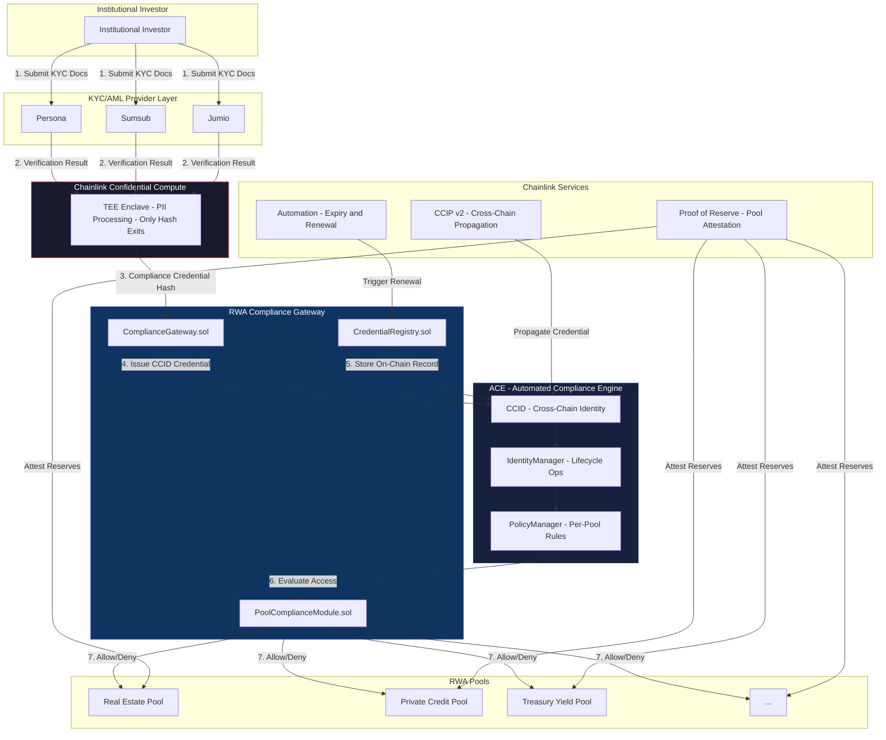

# RWA Compliance Gateway

[](https://soliditylang.org)
[](https://book.getfoundry.sh/)
[](https://chain.link/cross-chain)
[](https://opensource.org/licenses/MIT)
[]()
[]()
[](https://immunefi.com/)

> **Verify once. Invest anywhere.** Institutional RWA compliance automation -- one KYC/AML verification, universal access to all participating tokenized real-world asset pools across all supported chains.

---

## Status

**Active Development** -- Target: Q3 2026 launch. The RWA Compliance Gateway is currently in pre-production engineering sprint with a 7-9 week delivery timeline. All core smart contracts, CRE workflows, and ACE integrations are being built concurrently.

---

## Architecture Overview



---

## Quickstart

### Prerequisites

- **Foundry** (forge, cast, anvil) -- `curl -L https://foundry.paradigm.xyz | bash`
- **Node.js** >=20 LTS -- CRE workflow compilation
- **Docker** -- optional, for TEE simulation in local dev

### Clone and Build

```bash
git clone https://github.com/nousresearch/rwa-compliance-gateway.git
cd rwa-compliance-gateway
forge install
forge build
```

### Run Tests

```bash
forge test                      # Full suite (>=90% coverage required)
forge test --match-path test/fuzz   # Fuzzing + invariant tests
forge coverage                  # Generate coverage report
```

### Local Development Chain

```bash
# Terminal 1: Start Anvil with Chainlink mock oracles
anvil --fork-url $ETH_RPC_URL

# Terminal 2: Deploy contracts
forge script script/DeployLocal.s.sol --rpc-url http://localhost:8545 --broadcast

# Terminal 3: Run CRE workflows (TypeScript -> WASM)
cd workflows && npm run dev
```

### Static Analysis

```bash
slither .                       # Slither static analysis
aderyn .                        # Aderyn vulnerability scanner
```

Both Slither and Aderyn run in CI on every PR. Zero warnings required for merge.

---

## Tech Stack

| Layer | Technology | Version / Notes |
|-------|-----------|-----------------|
| **Smart Contracts** | Solidity + Foundry | 0.8.30+, UUPS upgradeable |
| **Access Control** | OpenZeppelin AccessControl | Role-based, not Ownable |
| **Reentrancy Guard** | ReentrancyGuardTransient | OZ 5.x transient storage |
| **Admin Governance** | Safe (multi-sig) + TimelockController | 3/N threshold, 48h delay |
| **Chainlink CRE** | Chainlink Runtime Environment | WASM-based compliance workflows |
| **Chainlink ACE** | Automated Compliance Engine | CCID, PolicyManager, IdentityManager (Beta) |
| **Confidential Compute** | Chainlink TEE Enclave | Intel SGX / AWS Nitro |
| **Cross-Chain** | Chainlink CCIP v2 | Credential propagation |
| **KYC/AML Providers** | Persona, Sumsub, Jumio | REST APIs via CRE Functions |
| **Automation** | Chainlink Automation | Expiry triggers, renewal scheduling |
| **Proof of Reserve** | Chainlink PoR | Real-time RWA pool attestation |
| **Workflow Language** | TypeScript -> WASM | CRE DON execution |
| **Secrets Management** | Vault DON | Encrypted KYC API keys |
| **CI/CD** | GitHub Actions | Slither, Aderyn, forge test, coverage |
| **Bug Bounty** | Immunefi | $50K+ critical reward |
| **License** | MIT | Open source |

---

## Key Features

### Verify-Once, Invest-Anywhere
Institutional investors complete KYC/AML, accreditation, and jurisdiction checks a single time. The resulting CCID-linked compliance credential gates access to **all** participating RWA pools across **all** supported chains. Eliminates the 2-4 week per-platform onboarding bottleneck.

### CCID Universal Identity
Every verified investor receives a **Cross-Chain Identity** (CCID) -- a Chainlink ACE primitive. The CCID serves as the universal credential anchor, decoupled from wallet addresses and portable across chains via CCIP v2.

### TEE-Backed Privacy
**No sensitive identity data ever touches the blockchain.** Chainlink Confidential Compute processes PII inside a TEE enclave (Intel SGX / AWS Nitro). Only the **compliance credential hash** exits the enclave and is stored on-chain. This design satisfies GDPR data minimization and privacy-by-default requirements.

### Per-Pool Configurable Compliance
RWA issuers define granular compliance rules via the ACE `PolicyManager`. Rules cover: investor accreditation tier, jurisdiction allow/block lists, minimum holding periods, maximum allocation caps, and credential freshness windows. Each pool is independently configured.

### Credential Lifecycle Management
Full lifecycle operations -- **issue**, **renew**, and **revoke** -- are automated via Chainlink Automation. Credentials carry expiry timestamps; Automation triggers renewal workflows before expiry and executes revocation on regulatory or issuer action.

### Cross-Chain Portability
Credentials propagate across chains via CCIP v2. An investor verified on Ethereum Mainnet can access an RWA pool on Arbitrum, Base, or any CCIP-supported chain without re-verification. The CCID travels with the investor.

### Issuer Dashboard
A web-based dashboard lets RWA issuers configure pool compliance rules, monitor credential status, review audit trails, and trigger manual interventions (e.g., emergency revocation). Built with real-time event indexing from on-chain events.

### Investor Self-Service Portal
Investors manage their KYC submissions, track credential status, view expiry dates, and initiate renewals through a self-service portal. No blockchain knowledge required -- wallet abstraction via social login + passkey options.

### Proof of Reserve Integration
Chainlink Proof of Reserve provides real-time reserve attestation for RWA pools. Investors and regulators can independently verify that on-chain tokens are fully collateralized by off-chain assets at all times.

---

## Smart Contract Architecture

```
contracts/
├── ComplianceGateway.sol       # Main entry: routes verification requests, interacts with ACE
├── CredentialRegistry.sol      # On-chain credential records: issue, renew, revoke, query
├── PoolComplianceModule.sol     # Per-pool rule evaluation: checks credential against PolicyManager
├── interfaces/
│   ├── IComplianceGateway.sol
│   ├── ICredentialRegistry.sol
│   ├── IPoolComplianceModule.sol
│   └── IACEPolicyManager.sol
├── libraries/
│   ├── ComplianceMath.sol       # Basis-point fee calculations, credential expiry math
│   └── JurisdictionLib.sol      # Jurisdiction code normalization and validation
└── governance/
    ├── GatewayTimelock.sol      # TimelockController for admin actions
    └── GatewayAccessControl.sol # Role definitions: ADMIN, ISSUER, COMPLIANCE_OFFICER
```

All contracts follow the **CEI pattern** (Checks-Effects-Interactions), use `ReentrancyGuardTransient` from OpenZeppelin 5.x, and are **UUPS upgradeable** with the proxy pattern. Full NatSpec documentation on every public and external function.

---

## Security

### TEE Privacy Architecture
The Confidential Compute enclave is the **trust boundary** for all PII. KYC provider API responses enter the enclave directly via TLS termination inside the TEE. The enclave:
1. Validates the KYC/AML result against provider signatures
2. Computes the compliance credential (accreditation status, jurisdiction, tier)
3. Hashes the credential with a random salt
4. Emits **only the hash** to the on-chain `CredentialRegistry`

At no point does raw identity data exist in Solidity storage, event logs, or calldata. This satisfies GDPR Article 25 (data protection by design) and Article 5(1)(c) (data minimization).

### GDPR Compliance Design
| GDPR Requirement | Implementation |
|-----------------|----------------|
| **Right to Erasure (Art. 17)** | Credential revocation zeroes the on-chain hash; PII exists only off-chain with provider, deleted per provider DPAs |
| **Data Minimization (Art. 5(1)(c))** | Only hash stored on-chain; raw data never leaves TEE |
| **Privacy by Design (Art. 25)** | TEE architecture ensures PII isolation by construction |
| **Data Processing Agreements** | Required with each KYC provider; gateway operator acts as data controller |
| **Cross-Border Transfers** | CCIP credential propagation transmits only hashes; no PII crosses jurisdictions |
| **Audit Trail** | On-chain events log credential operations without PII; off-chain audit log for compliance officers |

### Multi-Sig Governance
Admin actions (contract upgrades, pool configuration changes, emergency pauses) require:
- **Safe multi-sig** with 3-of-N threshold (configurable per deployment)
- **TimelockController** with minimum 48-hour delay before execution
- On-chain event emission for every queued and executed action

### OWASP Smart Contract Protections
The codebase implements all OWASP SC01-SC10 controls:
- **SC01: Access Control** -- `AccessControl` with granular roles, no `Ownable`
- **SC02: Arithmetic** -- Solidity 0.8.30 built-in overflow checks, basis-point math in `ComplianceMath`
- **SC03: Reentrancy** -- `ReentrancyGuardTransient` on all external state-mutating functions, CEI pattern
- **SC04: Oracle Manipulation** -- Chainlink CRE-native, no custom oracles
- **SC05: Front-Running** -- Timelock on admin actions; credential issuance is non-financial
- **SC06: Timestamp Dependence** -- `block.timestamp` used only for coarse expiry (30-day granularity)
- **SC07: Denial of Service** -- No unbounded loops; credential queries paginated
- **SC08: Logic Errors** -- >=90% test coverage, fuzzing + invariants, formal verification target
- **SC09: Gas Griefing** -- External calls are last (CEI), gas limits on callbacks
- **SC10: Unchecked Returns** -- All external calls check return values or use SafeERC20

### Bug Bounty
Active bug bounty program on **Immunefi** with a **$50,000+ critical reward**. Scope includes all smart contracts in `contracts/`, the CRE workflow WASM binaries, and the TEE attestation verification logic. See [SECURITY.md](./SECURITY.md) for full scope and rules.

---

## Deployed Addresses

> **Note:** The RWA Compliance Gateway is in active development. Deployed addresses will be published here upon testnet and mainnet launches.

| Network | Contract | Address |
|---------|----------|---------|
| Ethereum Sepolia (Testnet) | `ComplianceGateway` | TBD |
| Ethereum Sepolia (Testnet) | `CredentialRegistry` | TBD |
| Ethereum Sepolia (Testnet) | `PoolComplianceModule` | TBD |
| Arbitrum Sepolia (Testnet) | `ComplianceGateway` | TBD |
| Base Sepolia (Testnet) | `ComplianceGateway` | TBD |
| Ethereum Mainnet | All contracts | TBD -- Q3 2026 |

---

## Documentation

| Document | Description |
|----------|-------------|
| [PRODUCT_REQUIREMENTS_DOC.md](./PRODUCT_REQUIREMENTS_DOC.md) | Full product requirements: functional specs, architecture, risk register, invariants |
| [SECURITY.md](./SECURITY.md) | Security model, TEE attestation, bug bounty scope, audit reports |
| [CONTRIBUTING.md](./CONTRIBUTING.md) | Development setup, PR process, code standards, testing requirements |
| [ARCHITECTURE.md](./ARCHITECTURE.md) | Detailed technical architecture, data flows, CRE workflow specs |

---

## License

MIT License -- see [LICENSE](./LICENSE) for full text.

Copyright (c) 2026 Nous Research

---

## Contact

- **Engineering Team:** [engineering@nousresearch.com](mailto:engineering@nousresearch.com)
- **Security Disclosures:** [security@nousresearch.com](mailto:security@nousresearch.com) -- PGP key available on request
- **Bug Bounty:** [Immunefi Program](https://immunefi.com/)
- **Chainlink CRE Documentation:** [docs.chain.link/cre](https://docs.chain.link/cre)


## Why This Matters

### The RWA Market Inflection Point

Tokenized real-world assets represent the largest growth opportunity in blockchain. At **$26-32 billion** and growing **589% year-over-year**, RWAs are outpacing every other crypto sector. The key catalysts:

- **DTCC Q4 2026:** The Depository Trust and Clearing Corporation -- which processes over $2.5 quadrillion in securities transactions annually -- is building collateral rails on Chainlink CRE. This is the institutional endorsement that transforms RWA tokenization from a crypto-native experiment into global financial infrastructure.
- **Persona Partnership (May 2026):** Chainlink's partnership with Persona provides production-grade identity verification integrated directly into the Chainlink stack. The RWA Compliance Gateway is purpose-built to leverage this integration.
- **Institutional Demand:** Pension funds, endowments, and sovereign wealth funds are actively seeking on-chain yield through tokenized treasuries, private credit, and real estate. They require institutional-grade compliance -- not per-platform workarounds.

### The Compliance Gap

Despite the market growth, compliance infrastructure remains fragmented. Each RWA platform builds its own KYC/AML pipeline, creating:

1. **Redundant Cost:** Platforms collectively spend hundreds of millions on duplicative compliance infrastructure
2. **Investor Friction:** Institutional allocators face 2-4 week onboarding per platform, delaying capital deployment
3. **Privacy Risk:** Investor PII is replicated across dozens of platforms, multiplying breach surface area
4. **Regulatory Arbitrage:** Inconsistent compliance standards across platforms create opportunities for regulatory gaps

The RWA Compliance Gateway solves all four problems simultaneously by providing a single, shared compliance layer that is more secure, more private, and more efficient than any individual platform can build.

---

## How It Works

### Step by Step

1. **Investor Onboarding (5-15 minutes):** An institutional investor accesses the Investor Portal, selects a KYC provider (Persona, Sumsub, or Jumio), and submits entity documentation: certificate of incorporation, tax ID, ownership structure, and beneficial owner KYC. The portal guides investors through a streamlined workflow with real-time validation.

2. **KYC/AML Verification (automated: minutes; manual: up to 48 hours):** The selected KYC provider processes the submission. For standard cases, automated verification returns results in minutes. Complex entity structures may require manual review. The verification result includes: identity confirmation, accreditation status, jurisdiction assessment, and sanctions/PEP screening.

3. **TEE Processing (seconds):** The verification result enters a Chainlink Confidential Compute TEE enclave. Inside the hardware-isolated environment, the system validates the provider's cryptographic signature, computes the compliance credential, hashes it with a random salt, and destroys all PII from memory. Only the 32-byte credential hash exits the enclave.

4. **On-Chain Credential Issuance (one transaction):** The CRE DON submits the credential hash and TEE attestation to `ComplianceGateway.sol`. The contract validates the TEE attestation against the registered MRENCLAVE values, stores the credential hash in `CredentialRegistry.sol`, and links it to the investor's CCID via ACE IdentityManager. A `CredentialIssued` event is emitted.

5. **Cross-Chain Propagation (10-20 minutes):** CCIP v2 automatically propagates the credential to all registered destination chains. The `CrossChainCredentialReceiver` contract on each chain updates its local registry. The investor's CCID is now valid across the entire network.

6. **Pool Access (instant):** When the investor attempts to deposit into any participating RWA pool, the pool contract calls `PoolComplianceModule.checkCompliance(credentialHash, poolId)`. The function evaluates the credential against the pool's PolicyManager rules (tier, jurisdiction, freshness) and returns ALLOW or DENY in a single gas-efficient call.

### Credential Lifecycle

```
[Issue] ---> [Active] ---> [Renew] ---> [Active]
                |                         |
                +----> [Expire] ---> [Renew] ---> [Active]
                |
                +----> [Revoke] (terminal state)
```

Credentials carry a configurable expiry (default: 365 days). Chainlink Automation monitors all active credentials and triggers the renewal workflow 30 days before expiry. The renewal process performs a lightweight re-verification (accreditation status, sanctions check) without requiring full document re-submission. Revocation is a terminal state -- once revoked, a credential cannot be reactivated. A new credential must be issued through a complete re-verification.

---

## Development Roadmap

### Phase 1: Core Infrastructure (Weeks 1-3)
- Smart contract development: `ComplianceGateway.sol`, `CredentialRegistry.sol`, `PoolComplianceModule.sol`
- UUPS proxy deployment scripts
- Unit test suite (target: >=90% coverage)
- Slither + Aderyn CI integration
- Local development environment with Chainlink mock oracles

### Phase 2: CRE Workflows (Weeks 4-5)
- Onboarding workflow (TypeScript -> WASM)
- KYC provider integration (Persona, Sumsub, Jumio)
- TEE attestation verification
- Vault DON secrets configuration
- Renewal and revocation workflows

### Phase 3: ACE Integration (Weeks 5-6)
- PolicyManager rule configuration interface
- CCID lifecycle management
- IdentityManager binding integration
- Cross-chain credential propagation via CCIP v2
- `CrossChainCredentialReceiver` deployment on Arbitrum Sepolia and Base Sepolia

### Phase 4: Dashboard and Portal (Weeks 6-7)
- Issuer compliance dashboard
- Investor self-service portal
- Event indexing and subgraph deployment
- Real-time alerting for credential events
- Proof of Reserve integration

### Phase 5: Security and Audit (Weeks 7-9)
- External smart contract audit (pre-launch)
- TEE attestation verification audit
- Penetration testing on CRE workflows
- Bug bounty program launch on Immunefi
- Mainnet deployment preparation

---

## Contributing

We welcome contributions from the Chainlink and RWA communities. Please see [CONTRIBUTING.md](./CONTRIBUTING.md) for:

- Development environment setup
- Pull request process and review standards
- Testing requirements (unit, fuzz, invariant)
- Code style guide (NatSpec, CEI pattern, AccessControl patterns)
- Security disclosure process

All contributors must pass CI checks including Slither, Aderyn, and >=90% test coverage before merge.

---

## Acknowledgments

Built on [Chainlink](https://chain.link) -- the industry-standard decentralized computing platform. Special thanks to:

- **Chainlink CRE Team** for the Runtime Environment and ACE infrastructure
- **Chainlink Confidential Compute Team** for TEE integration support
- **Persona** for KYC/AML provider partnership
- **DTCC** for pioneering institutional RWA infrastructure
- **The RWA tokenization community** for feedback on compliance requirements

---

*Verify Once. Invest Anywhere. The future of institutional RWA compliance starts here.*
