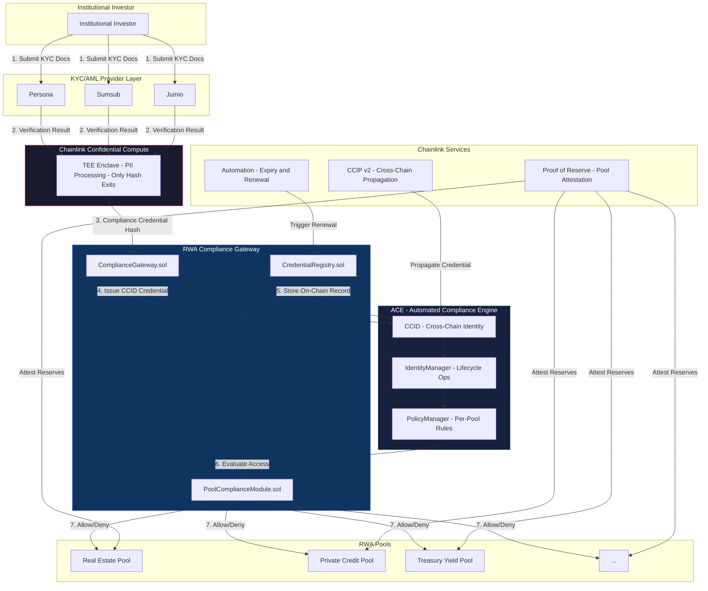

# RWA Compliance Gateway

> **Verify once. Invest anywhere.** Institutional RWA compliance automation -- one KYC/AML verification, universal access to all participating tokenized real-world asset pools across all supported chains.

---

## Status

**Active Development** -- Target: Q3 2026 launch. The RWA Compliance Gateway is currently in pre-production engineering sprint with a 7-9 week delivery timeline. All core smart contracts, CRE workflows, and ACE integrations are being built concurrently.

---

## Architecture Overview

